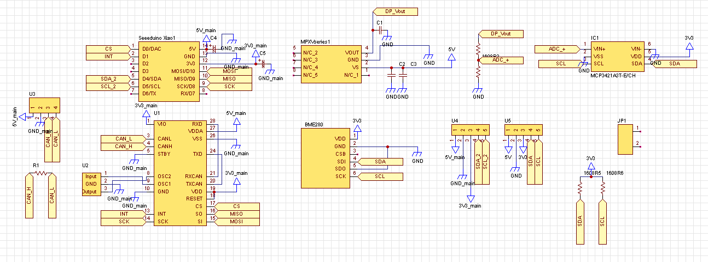

# ノーズ電装

## 概要
- This component has role of sensoring airspeed,temperature  and barometic pressure.
- This component communicates with the main electrical compnent via the CAN protocol.
## ハードウェア
### BOM
#### MCU
- Seeduino Xiao RP2040

#### Sensor
- AE-BME280
- MPXV5050DP
#### ADC
- MCP3421
#### CAN
- MCP25625
#### Component
##### Capacitor
- [100uF16V 電解コン](https://akizukidenshi.com/catalog/g/gP-05002/)
- [100uF10V 3216](https://akizukidenshi.com/catalog/g/gP-15633/)
- [1uF25V 1608](https://akizukidenshi.com/catalog/g/gP-14526/)
- [0.01uF50V 1608](https://akizukidenshi.com/catalog/g/gP-13387/)
- [470pF50V 1608](https://akizukidenshi.com/catalog/g/gP-09268/)
##### Resisiter
- [100k 1/10W 1608](https://akizukidenshi.com/catalog/g/gR-11792/)
- [49.9k 1/10W 1608](https://akizukidenshi.com/catalog/g/gR-11804/)
- [4.7k 1/10W 1608](https://akizukidenshi.com/catalog/g/gR-14121/)

### 回路

### PCB

## ソフトウェア
### 依存関係
- Wire.h
- CCP.h
- MCP342X.h[https://github.com/uChip/MCP342X]

## 基礎知識

### ベルヌーイの定理

$$p_1+\frac{1}{2} \rho v_1^2+\rho g z_1=p_2+\frac{1}{2}\rho v_2^2+\rho g z_2=\mathrm{const.}$$

https://www.cradle.co.jp/glossary/ja_H/detail0038.html

ここで空気密度$\rho$について考える．大気の標準組成は

- $O_2=20.99$ %
- $N_2=78.04$ %
- $CO_2=0.03$ %
- $Ar=0.94$ %

そこから求まる大気の分子量は
$$M=28.966[\mathrm{g/mol}]$$
となる．気体の質量密度は，
$$\rho=M\frac{n}{V}=\frac{MP}{RT}$$
ここで，$R=8.314[\mathrm{Nmmol^{-1}K^{-1}}]$，とすると，
$$\rho=\frac{28.966\times P}{8.314\times T}$$
とわかる．

http://sasaki.g1.xrea.com/powerpoint/vaporization-heat/03-Air-density.pdf

